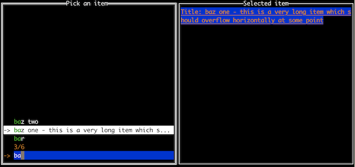

The finder primitive is inspired by [go-fuzzyfinder](https://github.com/ktr0731/go-fuzzyfinder) but is more 
configurable in terms of appearance.

In contrast to `go-fuzzyfinder`, this implementation does not use a fuzzy search algorithm. It will just 
search for and highlight the first substring that matches the entered text.

If you want to perform a more elaborate search, you can also provide a custom matcher function (see example `customatcher`).
